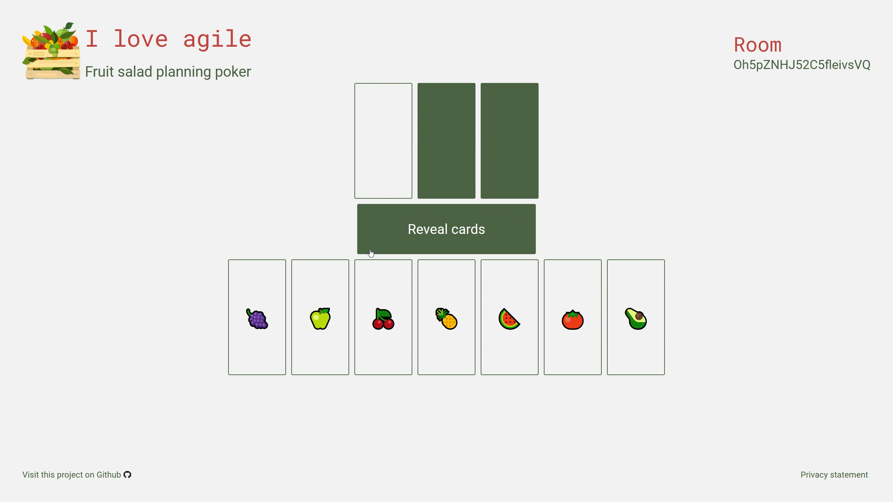

# Fruit salad planning poker
Fruit salad planning poker is a private just for fun project that I use to get to know firebase and React Native for Web. It is a planning poker for agile development, that is inspired by the fruit salad method. Here is an example of what a room looks like.

One can also select custom card values at this time.
# Contributing guide & future plans
So, you want to contribute or play around a bit? The code in this repo is in the state that I would call "It works". It is in no way perfect nor well structured. The code of the Room or the Home Screen is one big file that I want to refactor in the future. The Room, I think, should be turned into a state machine, so one needs to identify the states and transitions between them. On the one hand I wish I would have used TypeScript and not JavaScript for this to work nicely. On the other hand it will be a fun thing to implement it in JavaScript.

There are currently no automatic tests for the site. I am not sure how to create them for something like this and ideas are welcome :).

So, if the above does not scare you away, here comes the true contribution guide.
# The true contribution guide
If you want to contribute, you are welcome to share and discuss your ideas or code with me through issues. Please note, that I will only merge and deploy things into the repository that I personally want. If you want to do something that I don't want to use, please use a fork. Apart from that please be nice and be engaged. Thank you.

In the following table you find a description of the directories/files and a description
| Directory/File   |     Description
|----------|-------------
| .github/workflows |  Github workflows
| frontend |    The actual Website. In this folder the behaviour and the look and feel of the website is defined   
| .firebaserc | Project file for firebase
| .gitignore | Gitignore file
| database.rules.json | Rules for the firebase realtime database. Here one defines what a user of the website can access and what the user can't access
| firebase.json | Deployment file of firebase.
| FruitSaladPlaningPokerExample.gif | The gif used in this readme
| README.md | This readme file

## Frontend
### Requirement
Node JS: Download [here](https://nodejs.org/en/)

Expo CLI: Installation guide can be found [here](https://docs.expo.dev/get-started/installation/). You do *not* need a Expo dev account.
### Running the website locally
Do the following:
```cmd
cd frontend
npm install
```
Then run `expo start` or `npx expo start`. Once expo started the Metro Builder you can press `w` to start the local webserver. Be aware that the calls to the backend serverless functions will not be handled locally.

## Functions
### Requirement
Firebase CLI: Installation guid found [here](https://firebase.google.com/docs/functions/local-emulator#install_the_firebase_cli). It will probably tell you to run `npm install -g firebase-tools`
### Running function locally
I have never tried this but probably you need to run `firebase emulators:start`. If you have questions, please consider this [guide](https://firebase.google.com/docs/functions/local-emulator#run_the_emulator_suite).
## Rules
See section Function.

